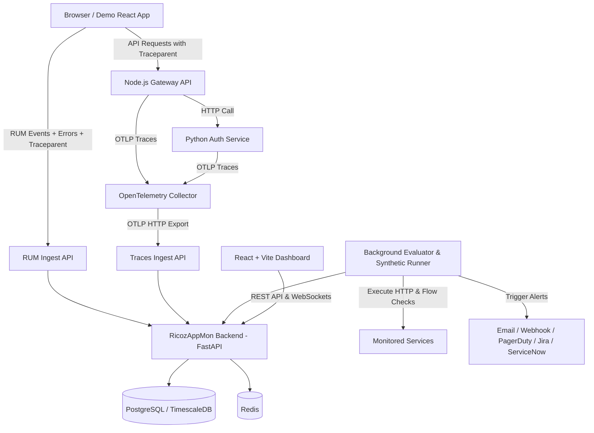

# ⚡ RicozAppMon - Full Stack Observability & APM Platform

RicozAppMon is an enterprise-grade, full-stack application performance monitoring (APM) and observability platform designed to monitor web applications, distributed backend microservices, real user sessions, frontend/backend errors, and synthetic endpoint health.

---

## 🏗️ Architecture & Technology Stack



### Core Stack
| Area | Technology |
|---|---|
| **Backend** | Python 3.12+, FastAPI, SQLAlchemy 2.0 Async, Pydantic v2 |
| **Storage** | PostgreSQL + TimescaleDB (production) / SQLite async (local zero-config) |
| **Background Jobs** | Async Scheduler (Rate limiting, alert evaluation, synthetic execution) |
| **Collection** | OpenTelemetry Collector, OTLP HTTP / gRPC Forwarding |
| **RUM SDK** | Vanilla TypeScript (< 5KB gzipped), Web Vitals, W3C `traceparent` injection, resilient defensive execution |
| **Dashboard** | React 18, TypeScript, Vite, Modern Glassmorphic CSS design system, Lucide Icons |
| **Synthetic Checks** | Async HTTP single checks + multi-step workflows with variable extraction & SLA timing breakdowns |
| **Alerting** | State machine (OK -> PENDING -> FIRING -> RESOLVED) with anti-flapping duration & multichannel adapters |

---

## 📁 Monorepo Layout

```text
Ricoz/
├── backend/            # FastAPI backend core
│   ├── app/
│   │   ├── api/v1/     # REST endpoints (auth, applications, rum, errors, traces, alerts, synthetics)
│   │   ├── core/       # Config, database engine, RBAC & security
│   │   ├── models/     # SQLAlchemy 2.0 async models
│   │   ├── services/   # Fingerprinting, SourceMap symbolicator, trace analyzer, alert evaluator
│   │   └── workers/    # Background synthetic runner & alert evaluator scheduler
│   ├── tests/          # Comprehensive pytest test suite
│   └── Dockerfile
├── rum-sdk/            # Vanilla TypeScript browser monitoring SDK
│   ├── src/            # Vitals, navigation, network interceptor, error tracker, scrubber, transport
│   └── dist/           # Minified standalone bundle (ricoz-rum.min.js) & ESM/UMD modules
├── dashboard/          # React + Vite observability dashboard
│   ├── src/
│   │   ├── components/ # Sidebar, Header, StatCard, WebVitalGauge, TraceWaterfall, ServiceMap
│   │   ├── pages/      # Overview, RUM, Errors, Traces, Synthetics, Alerts, Settings
│   │   └── styles/     # Glassmorphic dark mode CSS design system
│   └── Dockerfile
├── collector/          # OpenTelemetry Collector configuration
│   └── otel-collector-config.yaml
├── demo-apps/          # Communicating test applications
│   ├── react-client/   # Vite React demo storefront with RUM SDK
│   ├── node-api/       # Express.js API gateway
│   ├── python-auth/    # FastAPI authentication microservice
│   └── traffic-generator.py # Automated continuous telemetry simulator
└── deploy/             # Production deployment
    ├── docker-compose.yml
    ├── init-db.sql
    └── nginx.conf
```

---

## 🚀 Quickstart Guide

### 1. Run Backend Locally
```bash
cd backend
python -m pip install -r requirements.txt
uvicorn app.main:app --host 0.0.0.0 --port 8000 --reload
```
API Documentation will be live at: `http://localhost:8000/docs`

### 2. Run Dashboard Locally
```bash
cd dashboard
npm install
npm run dev
```
Dashboard will open at: `http://localhost:3000`

### 3. Run RUM SDK Build
```bash
cd rum-sdk
npm install
npm run build
```
Build outputs minified `dist/ricoz-rum.min.js` (< 5KB gzipped).

### 4. Run Unit & Service Tests
```bash
python -m pytest backend/tests -v
```

### 5. Production Docker Compose Deployment
```bash
cd deploy
docker compose up -d
```

---

## 🌟 Feature Tour by Phase

### Phase 0: Foundations & RBAC
- Multi-tenant team isolation with Roles: `admin`, `engineer`, `viewer`.
- Secure JWT authentication and SHA-256 application ingest key generation (`rz_live_...`).
- Zero-config auto-seeding with default Admin (`admin@ricozappmon.io` / `admin123`).

### Phase 1: Real User Monitoring (RUM SDK & Rollups)
- **Web Vitals Observer**: LCP, INP, CLS, TTFB, and FCP with Google Good/Needs Improvement/Poor rating gauges.
- **SPA Route Tracking**: Intercepts `pushState`, `replaceState`, and `popstate`.
- **W3C Distributed Tracing Header Injection**: Injects `traceparent` headers into `fetch` and `XMLHttpRequest` calls for end-to-end trace correlation.
- **Privacy Scrubber**: Automatically redacts query parameters, tokens, credit card numbers, and PII.
- **Session Explorer**: Tracks user journeys with 30-minute idle expiration and session replays.

### Phase 2: Error Diagnostics & Source Maps
- **Deterministic Fingerprinting**: Strips dynamic parameters (UUIDs, numbers, hex hashes) to group identical errors.
- **Source Map Symbolicator**: Decodes Source Map v3 VLQ mappings to map minified stack traces to original TypeScript/JavaScript source code lines and context.
- **User Breadcrumbs**: Captures recent UI clicks, route changes, and network calls leading to an error.

### Phase 3: Alerting Engine & Multichannel Notifications
- **Anti-Flapping State Machine**: `OK` -> `PENDING` -> `FIRING` -> `RESOLVED` requiring conditions to hold for configurable duration windows.
- **Multichannel Adapters**: Supports Webhooks, Email (SES/SMTP), SMS/PagerDuty, Jira, and ServiceNow REST APIs.

### Phase 4: Distributed Tracing & Service Map
- **Trace Waterfall Visualizer**: Hierarchical tree showing microservice color coding, timing offsets, and span attributes.
- **Root Cause Bottleneck Detection**: Automatically detects the bottleneck database query or failing microservice span.
- **Live Service Map**: Directed dependency graph calculating calls/min, latency, and error rates across nodes and edges.

### Phase 5: Synthetic Monitoring
- **Check Types**: Single HTTP/HTTPS checks and multi-step API flows with dynamic variable extraction (e.g. login -> grab JWT -> fetch profile).
- **Live Test Runner**: Real-time "Test Now" modal providing fine-grained timing breakdowns (DNS, TCP, TLS, TTFB, total).

---

## 🔒 Security & Best Practices
- Encrypted / Hashed credentials (SHA-256 for Ingest Keys, PBKDF2 / Bcrypt for passwords).
- Origin whitelist verification on RUM ingestion endpoints.
- Rate limiting protection (1,200 req/min per application).
- Remote kill switch on client RUM SDK to ensure zero disruption to host applications.
